# EmmBook: Spring Boot Authentication & Book Discovery System

This project is a software engineering project built with Spring Boot, combining JWT-based authentication with integration to the OpenLibrary API. This platform allows users to discover and explore books organized by categories while providing a complete user management system.

## Key Features
- JWT Authentication: Secure user authentication using JSON Web Tokens, ensuring stateless and scalable sessions.
- User Management: Registration, login, profile updates, and administrative functions.
- Role-Based Access Control: Differentiated permissions for regular users and admins.
- RESTful API: A well-documented API for seamless frontend (web/mobile) integration.
- Database Integration: Integration with MySQL for persistent storage of user data, ensuring reliability and scalability.
- Docker Support: Easy deployment and development using Docker and Docker Compose, with pre-configured environments for both backend and database services.
- Security Best Practices: Passwords are securely hashed using BCrypt, and sensitive information is protected through environment variables.
- Development Tools: Support for LiveReload and Spring DevTools to enhance the development experience.
- OpenLibrary API Integration: Fetch and explore books from OpenLibrary’s public database.
- Category-Based Organization: Books are sorted into categories for easy discovery.

## Use Cases
EmmBook is ideal for:

- Educational Projects: Demonstrates Spring Boot best practices, JWT auth, and external API consumption.
- Book Discovery Platforms: Lets users explore books in an organized way.
- Rapid Prototyping: A ready-to-use backend for startups needing user auth + book data.
- Microservices: Can be integrated as an authentication module in larger systems.

## Authentication 

The application provides several endpoints for user authentication and management:

**URL**: `/auth/register`
**Method**: `POST`
**Parameters**:
> | name      |  type     | data type               | description                                                           |
> |-----------|-----------|-------------------------|-----------------------------------------------------------------------|
> | username      |  required | String   | The username for the new account  |
> | password      |  required | String   | The password for the new account  |
> | firstName      |  required | String   | The first name of the user  |
> | lastName      |  required | String   | The last name of the user  |
> | country      |  required | String   | The country of the user  |
> | role      |  optional | String   | The role for the user (defaults to USER if not specified)  |

**Responses**:

> | http code     | content-type                      | response                                                            |
> |---------------|-----------------------------------|---------------------------------------------------------------------|
> | `400`         | `application/json`    | `{"Error":"Error message"}` |
> | `200`         | `application/json`    | `Success response (empty)`                      |

**Example request**:
```js
{
  "username": "john.doe",
  "password": "securepassword123",
  "firstName": "John",
  "lastName": "Doe",
  "country": "USA",
  "role": "USER"
}
```

---
**URL**: `/auth/login`
**Method**: `POST`
**Parameters**:
> | name      |  type     | data type               | description                                                           |
> |-----------|-----------|-------------------------|-----------------------------------------------------------------------|
> | username      |  required | String   | The username for authentication  |
> | password      |  required | String   | The password for authentication  |

**Responses**:

> | http code     | content-type                      | response                                                            |
> |---------------|-----------------------------------|---------------------------------------------------------------------|
> | `401`         | `application/json`    | `null` (Authentication failed) |
> | `200`         | `application/json`    | `{"token": "JWT_TOKEN"}`                      |

**Example request**:
```js
{
  "username": "john.doe",
  "password": "securepassword123"
}
```

**Example response**:
```js
{
  "token": "eyJhbGciOiJIUzI1NiIsInR5cCI6IkpXVCJ9..."
}
```

---
**URL**: `/api/info`
**Method**: `GET`
**Parameters**:
> | name      |  type     | data type               | description                                                           |
> |-----------|-----------|-------------------------|-----------------------------------------------------------------------|
> | Authorization      |  required | String   | The JWT token in header (Bearer token)  |

**Responses**:

> | http code     | content-type                      | response                                                            |
> |---------------|-----------------------------------|---------------------------------------------------------------------|
> | `401`         | `application/json`    | Unauthorized (invalid token) |
> | `200`         | `application/json`    | User information and token claims |

**Example response**:
```js
{
  "claims": {
    "sub": "john.doe",
    "iat": 1709705342,
    "exp": 1709708942,
    "roles": ["USER"]
  },
  "usuario": {
    "id": 1,
    "username": "john.doe",
    "firstName": "John",
    "lastName": "Doe",
    "country": "USA",
    "roles": ["USER"]
  }
}
```

---
**URL**: `/api/admin/all-info`
**Method**: `GET`
**Parameters**:
> | name      |  type     | data type               | description                                                           |
> |-----------|-----------|-------------------------|-----------------------------------------------------------------------|
> | Authorization      |  required | String   | The JWT token in header (Bearer token with ADMIN role)  |

**Responses**:

> | http code     | content-type                      | response                                                            |
> |---------------|-----------------------------------|---------------------------------------------------------------------|
> | `401`         | `application/json`    | Unauthorized (invalid token) |
> | `403`         | `application/json`    | Forbidden (not an admin) |
> | `200`         | `application/json`    | List of all users |

**Example response**:
```js
[
  {
    "username": "john.doe",
    "firstname": "John",
    "lastname": "Doe",
    "country": "USA",
    "role": "USER"
  },
  {
    "username": "admin.user",
    "firstname": "Admin",
    "lastname": "User",
    "country": "Canada",
    "role": "ADMIN"
  }
]
```

---
**URL**: `/api/update`
**Method**: `PUT`
**Parameters**:
> | name      |  type     | data type               | description                                                           |
> |-----------|-----------|-------------------------|-----------------------------------------------------------------------|
> | Authorization      |  required | String   | The JWT token in header (Bearer token)  |
> | UserDto      |  required | Object   | User data to update  |

**Responses**:

> | http code     | content-type                      | response                                                            |
> |---------------|-----------------------------------|---------------------------------------------------------------------|
> | `401`         | `application/json`    | Unauthorized (invalid token) |
> | `200`         | `application/json`    | Updated user information and new token |

**Example request**:
```js
{
  "username": "john.doe",
  "firstname": "Johnny",
  "lastname": "Doe",
  "country": "Canada"
}
```

**Example response**:
```js
{
  "user": {
    "id": 1,
    "username": "john.doe",
    "firstName": "Johnny",
    "lastName": "Doe",
    "country": "Canada",
    "roles": ["USER"]
  },
  "token": "eyJhbGciOiJIUzI1NiIsInR5cCI6IkpXVCJ9..."
}
```

---
**URL**: `/api/admin/update/{username}`
**Method**: `PUT`
**Parameters**:
> | name      |  type     | data type               | description                                                           |
> |-----------|-----------|-------------------------|-----------------------------------------------------------------------|
> | Authorization      |  required | String   | The JWT token in header (Bearer token with ADMIN role)  |
> | username      |  required | String   | Username of the user to update (in URL)  |
> | UserDto      |  required | Object   | User data to update  |

**Responses**:

> | http code     | content-type                      | response                                                            |
> |---------------|-----------------------------------|---------------------------------------------------------------------|
> | `401`         | `application/json`    | Unauthorized (invalid token) |
> | `403`         | `application/json`    | Forbidden (not an admin) |
> | `200`         | `application/json`    | Updated user information |

**Example request**:
```js
{
  "firstname": "John",
  "lastname": "Smith",
  "country": "UK",
  "role": "ADMIN"
}
```

**Example response**:
```js
{
  "user": {
    "id": 1,
    "username": "john.doe",
    "firstName": "John",
    "lastName": "Smith",
    "country": "UK",
    "roles": ["ADMIN"]
  }
}
```

---
**URL**: `/api/admin/delete/{username}`
**Method**: `DELETE`
**Parameters**:
> | name      |  type     | data type               | description                                                           |
> |-----------|-----------|-------------------------|-----------------------------------------------------------------------|
> | Authorization      |  required | String   | The JWT token in header (Bearer token with ADMIN role)  |
> | username      |  required | String   | Username of the user to delete (in URL)  |

**Responses**:

> | http code     | content-type                      | response                                                            |
> |---------------|-----------------------------------|---------------------------------------------------------------------|
> | `401`         | `application/json`    | Unauthorized (invalid token) |
> | `403`         | `application/json`    | Forbidden (not an admin) |
> | `200`         | `application/json`    | Empty response (success) |

## Project Structure

The project follows a standard Spring Boot architecture:

- `auth` package: Contains authentication controllers
- `config` package: Contains security configuration
- `controllers` package: REST and view controllers
- `dtos` package: Data Transfer Objects
- `exception` package: Errors & exceptions management
- `model` package: Entity classes
- `repository` package: Data access layer
- `service` package: Business logic
- `resources/templates` package: HTML templates for View
- `resources/static` package: CSS, JS & images resources

## Discovery Books Details
- Book classification: Sci-Fi, Fantasy, Fiction, Thriller & Biographies
- Book details: Books' complete info:
  - Cover
  - Title
  - Author(s)
  - Publish date
  - Editorial
  - ISBN and pages' number
  - Subjects
  - Link to OpenLibrary

## Security Configuration

The security configuration uses JWT (JSON Web Token) for authentication:

- Tokens are valid for 1 hour (3,600,000 milliseconds)
- Passwords are encrypted using BCrypt
- API endpoints are secured by role-based authorization
- Web views are accessible under the `/view` path

## Installation

To run the application, you need:

1. Java 21 or higher
2. MySQL database

Configure your database connection in a `.env` file:

```properties
spring.datasource.url=jdbc:mysql://localhost:3306/your_database_name?useSSL=false&serverTimezone=UTC
spring.datasource.username=your_database_username
spring.datasource.password=your_database_password
```
To build and run with Docker Compose:

```sh
docker-compose up --build
```

## Dockerfiles

The project includes the following Dockerfiles:

```
# Imagen base para compilar y desarrollo
FROM maven:3.9-eclipse-temurin-21-alpine

# Establece el directorio de trabajo
WORKDIR /app

# Instala herramientas necesarias
RUN apk add --no-cache bash netcat-openbsd mysql-client dos2unix

# Copia el archivo pom.xml para descargar dependencias
COPY pom.xml .

# Descarga dependencias
RUN mvn dependency:go-offline -B

# Copia el script start.sh
COPY start.sh .

# Convierte los finales de línea y establece permisos
RUN dos2unix /app/start.sh && \
    chmod +x /app/start.sh

# Punto de entrada usando bash
ENTRYPOINT ["/bin/bash", "/app/start.sh"]
```

### Docker Compose Configuration:

The docker-compose.yml file configures the following services:

1. MySQL Database:

- Image: mysql:8.0
- Port: 3306
- Environment variables: MYSQL_ROOT_PASSWORD, MYSQL_DATABASE
- Volumes: mysql-data for persistent storage and schemas.sql for initial database setup.

2. Spring Boot Application:

- Build context: Current directory
- Ports: 8081 (application) and 35729 (LiveReload)
- Environment variables: Database connection, JWT secret, and development tools configuration.
- Volumes: Source code, Maven repository, and .env file for environment variables.

```
services:
  mysql:
    image: mysql:8.0
    container_name: mysql-db
    restart: always
    environment:
      MYSQL_ROOT_PASSWORD: johann21
      MYSQL_DATABASE: tarea2
    ports:
      - "3306:3306"
    volumes:
      - mysql-data:/var/lib/mysql
      - ./src/main/resources/schemas.sql:/docker-entrypoint-initdb.d/schemas.sql
    healthcheck:
      test: ["CMD", "mysqladmin", "ping", "-h", "localhost", "-pjohann21"]
      interval: 10s
      timeout: 5s
      retries: 5
    networks:
      - spring-network

  app:
    build:
      context: .
      dockerfile: dockerfile
    container_name: spring-app
    restart: always
    depends_on:
      mysql:
        condition: service_healthy
    ports:
      - "8081:8081"
      - "35729:35729" # Puerto para LiveReload
    volumes:
      - ./src:/app/src
      - ./pom.xml:/app/pom.xml
      - ./.env:/app/.env # Montar el archivo .env para compatibilidad
      - maven-repo:/root/.m2
    networks:
      - spring-network
    environment:
      # Conexión a MySQL usando el nombre del servicio
      DB_URL: jdbc:mysql://mysql:3306/tarea2?useSSL=false&serverTimezone=UTC&allowPublicKeyRetrieval=true
      DB_USERNAME: root
      DB_PASSWORD: johann21
      JWT_SECRET: EsteEsUnSecretoMuySeguroParaFirmarElTokenCon256Bits!
      # Configuración para desarrollo
      SPRING_DEVTOOLS_RESTART_ENABLED: "true"
      SPRING_DEVTOOLS_LIVERELOAD_ENABLED: "true"
      SPRING_DEVTOOLS_REMOTE_SECRET: "mysecret"

volumes:
  mysql-data:
  maven-repo:

networks:
  spring-network:
    driver: bridge
```

## Views

The application provides the following views:

- `/view/my-profile` - User profile page
- `/view/admin/all-users` - Admin page to manage users
- `/view/home` - Principal view of the system to discover books by subjects
- `/view/libro-detalle` - Complete details about a specific book
- `/view/login` - Login page
- `/view/register` - Register new users page

## Default Admin User

By default, is defined the user admin with the following credentials:

- **Username**: `admin`
- **Lastname**: `istrador`
- **Firstname**: `admin`
- **Country**: `Papua Nueva Guinea`
- **Password**: `password` (encrypted by BCrypt)
- **Role**: `ROLE_ADMIN`


## Screenshots

Here are some screenshots of the application (You can find more in `screenshots/Tarea3&Practica1/` and `screenshots/Practica2/` routes)

### User Registration
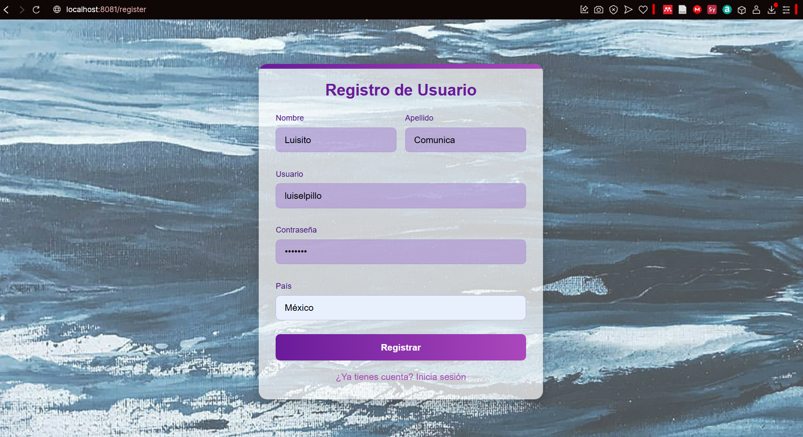

### User Registration (Dark Theme)
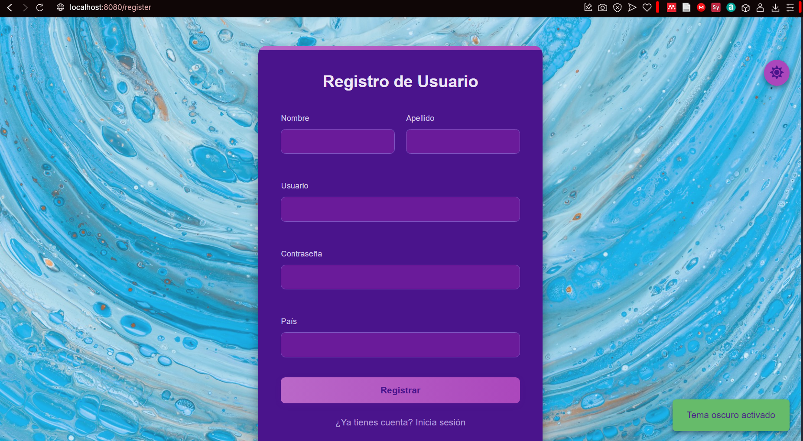

### Admin Dashboard
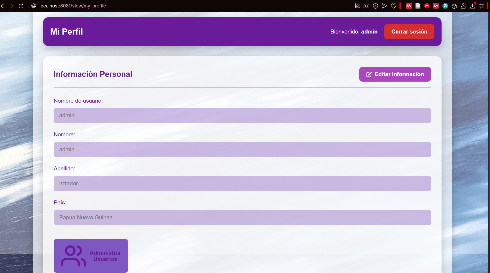

### All Users
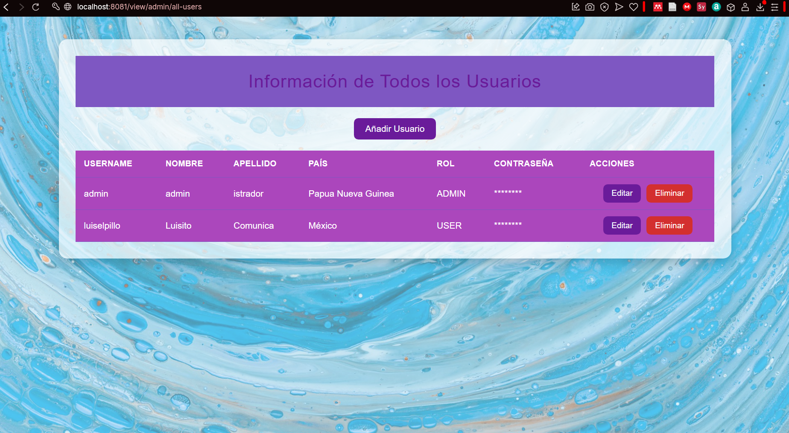

### All Users (Dark Theme)
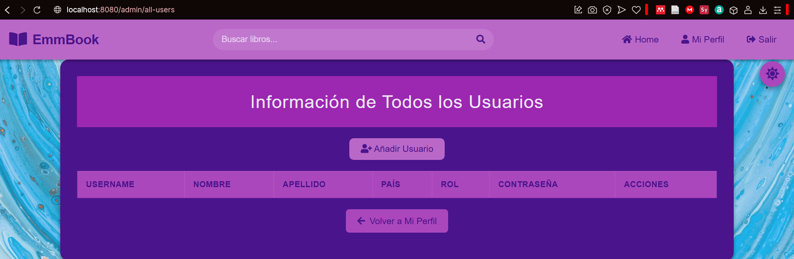

### New Users Form
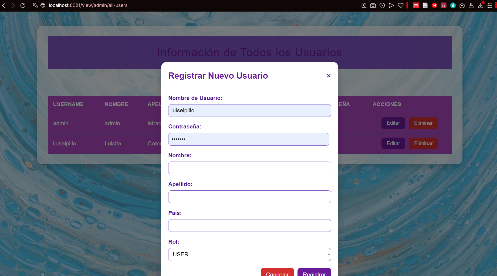

### User Profile
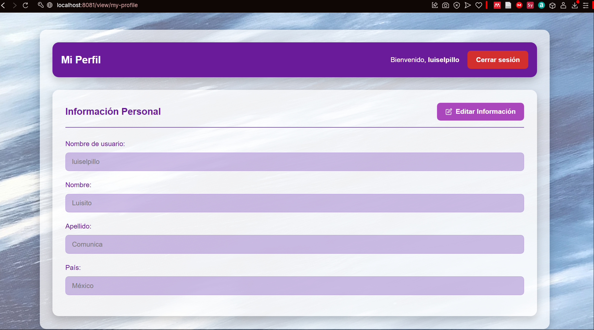

### User Profile (Dark Theme)
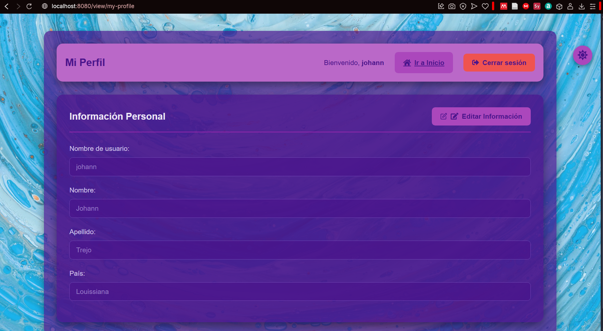

### Login
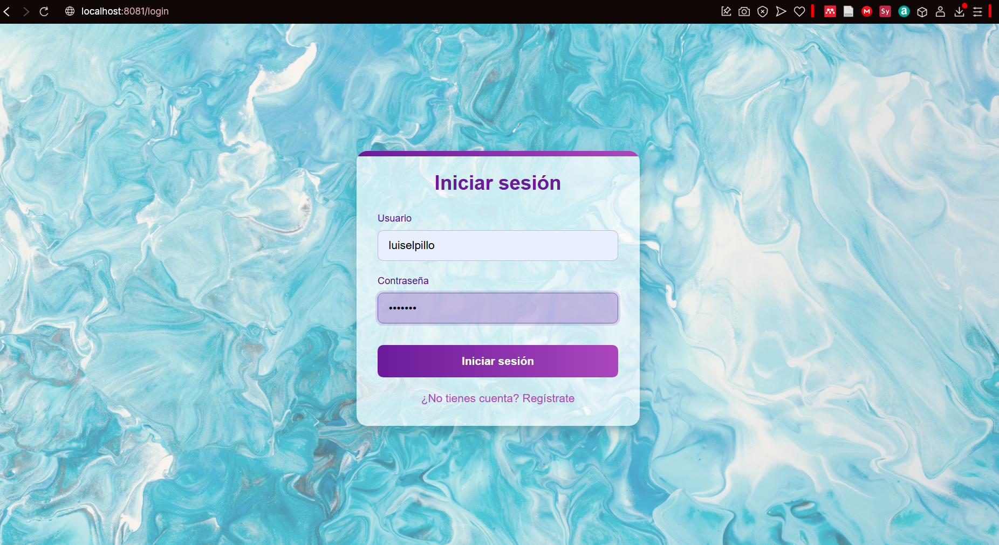

### Login (Dark Theme)
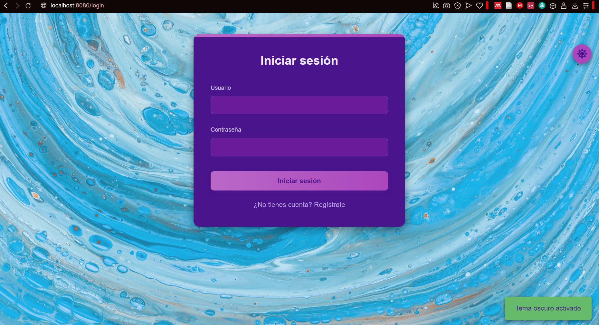

### Home (Dark Theme)
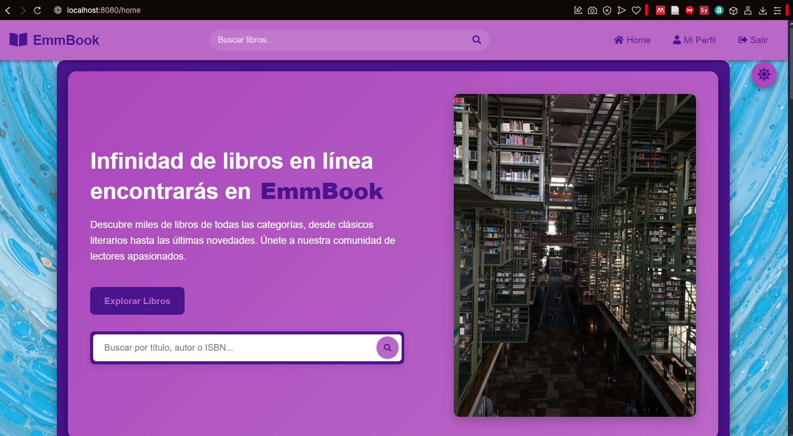

### Book Cover
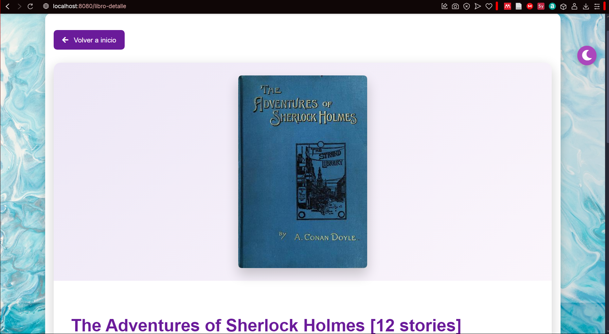

### Book Details
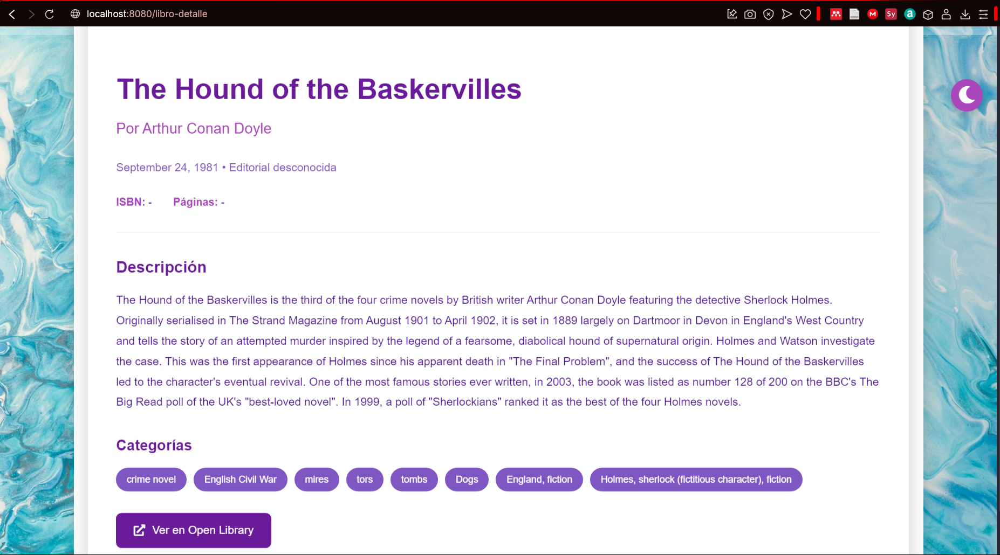

### Book Details (Dark Theme)
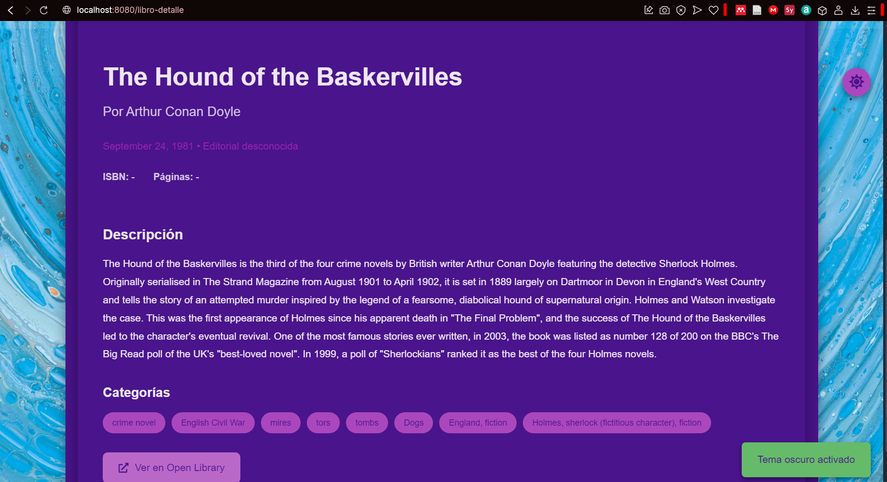

 
